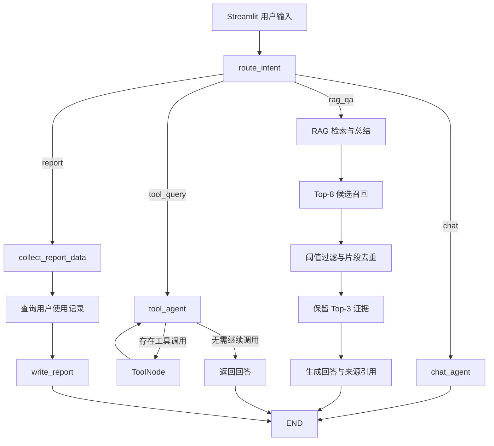

<div align="center">

# RoboCare Agent

**基于 LangGraph 的扫地机器人智能客服系统**

[](https://www.python.org/)
[](https://github.com/langchain-ai/langgraph)
[](https://www.trychroma.com/)
[](https://streamlit.io/)
[](./LICENSE)

</div>

## 项目简介

RoboCare Agent 是一个面向扫地机器人服务场景的智能客服项目，覆盖日常对话、产品知识问答、业务工具查询和用户使用报告生成。

项目使用 LangGraph `StateGraph` 编排执行流程，通过“高置信度规则 + 大模型结构化分类”识别用户意图，并将请求路由到相应的处理分支。知识类问题由本地 Chroma 知识库提供依据，业务查询通过 ReAct 工具循环执行，报告任务则按照固定的数据收集与生成流程完成。

## 核心功能

- **四类意图路由**：识别 `chat`、`rag_qa`、`tool_query` 和 `report` 请求。
- **ReAct 工具调用**：支持模型自主选择工具，并执行 `Agent → Tools → Agent` 多步循环。
- **本地知识库问答**：加载 TXT、PDF 文档，通过 DashScope Embedding 和 Chroma 完成语义检索。
- **可追溯 RAG**：回答展示来源文件、PDF 页码和相关度；知识不足时明确拒答。
- **增量知识入库**：使用文件 MD5 避免同一源文档被重复写入向量库。
- **稳定用户上下文**：用户 ID、城市和报告月份通过 LangGraph State 传递，工具使用 `InjectedState` 读取。
- **使用报告生成**：查询指定用户和月份的使用记录，生成清洁效率、设备表现和维护建议报告。
- **交互式界面**：使用 Streamlit 提供多轮对话、用户上下文选择和流式回答展示。

## 系统架构



### 请求分支

| 意图 | 适用场景 | 执行流程 |
|---|---|---|
| `chat` | 问候、闲聊、能力介绍 | `chat_agent → END` |
| `rag_qa` | 产品功能、使用方法、故障排查 | `rag_qa → END` |
| `tool_query` | 天气、用户信息、月份和记录查询 | `tool_agent ↔ tools → END` |
| `report` | 指定用户、月份的使用报告 | `collect_report_data → write_report → END` |

## RAG 检索策略

知识库流程分为入库和查询两个阶段：

1. 从 `data/` 加载 TXT 和 PDF 文档。
2. 使用 `RecursiveCharacterTextSplitter` 进行递归文本切分。
3. 通过 `text-embedding-v4` 生成向量并写入 Chroma。
4. 使用源文件 MD5 记录已处理文档，实现增量去重。
5. 查询时先召回 8 个候选片段。
6. 根据相关度阈值过滤弱相关结果，并对重复文本片段去重。
7. 最多保留 3 个证据片段，交给大模型生成受知识库约束的回答。
8. 后端根据真实召回结果附加来源信息，避免模型自行编造引用。

默认检索参数位于 `config/chroma.yml`：

```yaml
k: 3
fetch_k: 8
score_threshold: 0.25
chunk_size: 200
chunk_overlap: 20
```

## 技术栈

| 模块 | 技术 |
|---|---|
| 工作流编排 | LangGraph、StateGraph |
| Agent 与工具 | LangChain、ToolNode、InjectedState |
| 对话模型 | GLM-5（通过 ChatTongyi 接入 DashScope） |
| 向量模型 | DashScope `text-embedding-v4` |
| 向量数据库 | Chroma |
| 文档处理 | PyPDF、RecursiveCharacterTextSplitter |
| 用户界面 | Streamlit |
| 配置管理 | YAML |
| 测试评测 | unittest、自定义 JSONL 评测集 |

## 项目结构

```text
RoboCare-Agent/
├── agent/
│   ├── react_agent.py          # StateGraph、意图路由、节点和执行入口
│   └── tools/
│       ├── agent_tools.py      # 业务工具定义
│       └── middleware.py       # 旧版 Middleware 兼容说明
├── rag/
│   ├── vector_store.py         # 文档切分、向量入库和 MD5 去重
│   └── rag_service.py          # 检索过滤、答案生成和来源格式化
├── model/
│   └── factory.py              # 对话模型与 Embedding 模型工厂
├── prompts/
│   ├── main_prompt.txt         # 普通对话 Prompt
│   ├── intent_router.txt       # 意图分类 Prompt
│   ├── tool_query.txt          # 工具查询 Prompt
│   ├── rag_summarize.txt       # RAG 总结 Prompt
│   └── report_prompt.txt       # 报告生成 Prompt
├── config/                     # 模型、向量库和 Prompt 配置
├── data/                       # 示例知识文档与模拟使用记录
├── tests/
│   ├── test_intent_routing.py  # 意图路由单元测试
│   ├── test_user_context.py    # 用户上下文单元测试
│   ├── test_rag_service.py     # RAG 服务单元测试
│   ├── eval_cases.jsonl        # 端到端评测数据
│   └── evaluate.py             # RAG 与 Agent 评测脚本
├── assets/                     # 项目截图
├── app.py                      # Streamlit 应用入口
├── requirements.txt
└── .env.example
```

## 快速开始

### 1. 克隆项目

```powershell
git clone https://github.com/SBing-H/RoboCare-Agent.git
cd RoboCare-Agent
```

### 2. 创建并激活虚拟环境

使用 venv：

```powershell
python -m venv .venv
.\.venv\Scripts\Activate.ps1
```

也可以使用 Conda：

```powershell
conda create -n robocare python=3.10 -y
conda activate robocare
```

### 3. 安装依赖

```powershell
pip install -r requirements.txt
```

### 4. 配置 API Key

当前程序从系统环境变量读取 DashScope API Key。在启动应用的 PowerShell 窗口中执行：

```powershell
$env:DASHSCOPE_API_KEY="your-api-key"
```

该设置只在当前 PowerShell 会话中生效。也可以在 VS Code、PyCharm 或系统环境变量中配置同名变量。不要将真实 API Key 写入 `.env.example` 或提交到 Git。

### 5. 初始化知识库

首次启动前执行：

```powershell
python -c "from rag.vector_store import VectorStoreService; VectorStoreService().load_document()"
```

该操作会生成本地 `chroma_db/` 和 `md5.txt`，两者均属于运行时数据，不需要提交到 Git。

### 6. 启动应用

```powershell
streamlit run app.py
```

浏览器访问：<http://localhost:8501>

## 使用示例

可以在聊天框中测试以下问题：

```text
你好，请介绍一下你自己。
扫地机器人无法正常回充应该怎么排查？
我的用户 ID 是什么？
杭州今天天气怎么样？
帮我生成本月的扫地机器人使用报告。
```

生成报告前，可以在 Streamlit 侧边栏选择演示用户、所在城市和报告月份。

## 测试与评测

### 运行单元测试

```powershell
python -m unittest tests.test_intent_routing tests.test_user_context tests.test_rag_service -v
```

### 基础语法检查

```powershell
python -m compileall -q app.py agent rag model utils tests
```

### 运行真实模型评测

评测脚本会调用 DashScope API，请先设置有效的 API Key：

```powershell
python tests/evaluate.py --mode all --output tests/eval_results.json
```

也可以单独评测：

```powershell
python tests/evaluate.py --mode rag
python tests/evaluate.py --mode agent --limit 10
```

仓库中保存的一次 120 条样例评测结果如下：

| 指标 | 结果 |
|---|---:|
| 意图识别准确率 | 99.2% |
| 工具选择准确率 | 95.8% |
| RAG Top-3 命中率 | 92.6% |
| RAG MRR | 0.7881 |
| 报告生成成功率 | 100.0% |

> 上述结果来自 `tests/eval_results.json` 中保存的一次评测，仅代表当前测试集与当次模型调用结果。修改模型、Prompt、知识库或检索参数后，应重新运行评测。

## 配置说明

| 文件 | 作用 |
|---|---|
| `config/rag.yml` | 对话模型和 Embedding 模型名称 |
| `config/chroma.yml` | Chroma 路径、分块参数和检索参数 |
| `config/prompts.yml` | 各类 Prompt 文件路径 |
| `config/agent.yml` | 外部模拟数据路径 |

## 安全说明

- `.env`、本地日志和向量数据库均已通过 `.gitignore` 排除。
- 仓库中的用户使用记录仅用于功能演示，不应替换为真实用户隐私数据。
- 如果 API Key 曾被提交或公开，应立即在服务商控制台撤销并重新生成。

## 后续计划

- 增加节点耗时、工具调用次数和异常类型等可观测指标。
- 使用验证集进一步校准 RAG 相关度阈值。
- 增加跨编码器重排或混合检索，对比不同检索策略。
- 将模拟天气和使用记录工具替换为可配置的真实服务接口。

## License

本项目基于 [MIT License](./LICENSE) 开源。
